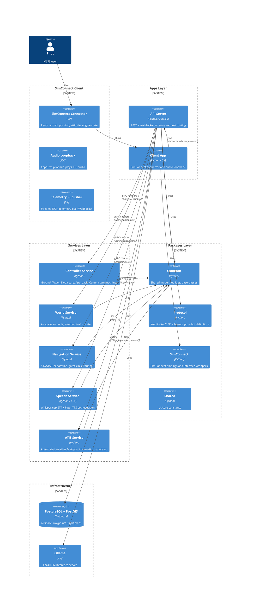
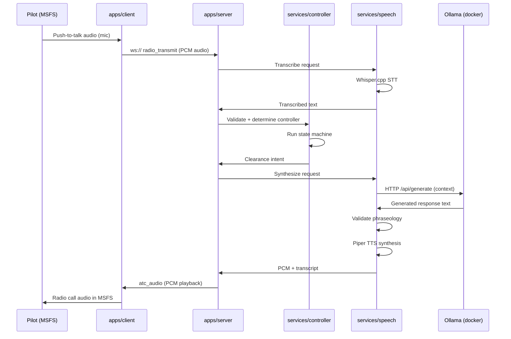
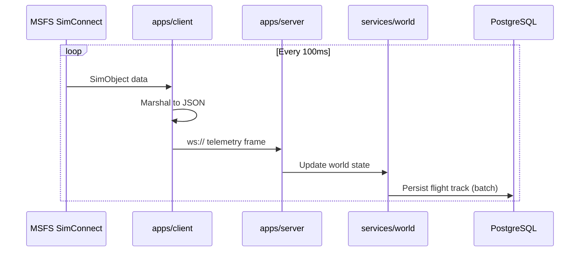

# System Architecture

## Monorepo Service Boundaries

```
openatc/
├── apps/
│   ├── server/                 # FastAPI entrypoint — REST + WebSocket gateway
│   │   ├── src/
│   │   └── tests/
│   └── client/                 # SimConnect / external client application
│       ├── src/
│       └── tests/
├── services/
│   ├── controller/             # ATC controller logic engine — deterministic state machines
│   │   ├── src/
│   │   └── tests/
│   ├── world/                  # World state manager — airspace, airports, weather, traffic
│   │   ├── src/
│   │   └── tests/
│   ├── navigation/             # Spatial / routing calculation engine
│   │   ├── src/
│   │   └── tests/
│   ├── speech/                 # Whisper.cpp STT + Piper TTS integration service
│   │   ├── src/
│   │   └── tests/
│   └── atis/                   # ATIS broadcast service
│       ├── src/
│       └── tests/
├── packages/
│   ├── common/                 # Shared models, utilities, base classes
│   │   ├── src/
│   │   └── tests/
│   ├── protocol/               # WebSocket/RPC schemas and protocol definitions
│   │   ├── src/
│   │   └── tests/
│   ├── simconnect/             # SimConnect bindings and interface wrappers
│   │   ├── src/
│   │   └── tests/
│   └── shared/                 # Shared UI / core constants
│       ├── src/
│       └── tests/
├── docker/                     # Dockerfiles and service build contexts
├── scripts/                    # Dev, build, and database migration scripts
├── docs/                       # Architecture documentation (Phase 0)
└── tests/                      # End-to-end and integration tests
```

## System Context (C4 Level 1)

```mermaid
C4Context
  Person(pilot, "Pilot", "MSFS user interacting via radio")
  System_Ext(msfs, "Microsoft Flight Simulator", "SimConnect API")

  Boundary_Boundary("openatc", "AI-ATC System") {
    System(simconnect, "SimConnect Client", "C# — reads aircraft state, injects audio")
    System(engine, "ATC Engine", "Python — controller state machines, separation logic")
    System(speech, "Speech Pipeline", "Python — STT → LLM → TTS streaming")
    System(llm, "LLM Proxy", "Python — Ollama context management & prompt pipeline")
    System(ui, "Web UI", "TypeScript — pilot dashboard & radio overlay")
  }

  Rel(pilot, msfs, "Files")
  Rel(pilot, ui, "Configures / monitors")
  Rel(msfs, simconnect, "SimConnect protocol")
  Rel(simconnect, engine, "gRPC / WebSocket telemetry")
  Rel(simconnect, speech, "Audio loopback stream")
  Rel(engine, speech, "Radio event triggers")
  Rel(speech, llm, "HTTP generate requests")
  Rel(engine, ui, "WebSocket state push")
```

## Container Diagram (C4 Level 2)



## Data Flow — Pilot Radio Call End-to-End



## Data Flow — Telemetry Ingestion



## Technology Stack

| Component | Location | Language/Runtime | Key Libraries |
|-----------|----------|-----------------|---------------|
| API Server | `apps/server` | Python 3.12 | FastAPI, asyncpg, pydantic, httpx |
| Client App | `apps/client` | Python 3.12 / C# .NET | websockets, httpx |
| Controller Service | `services/controller` | Python 3.12 | asyncpg, pydantic |
| World Service | `services/world` | Python 3.12 | asyncpg, pydantic |
| Navigation Service | `services/navigation` | Python 3.12 | geographiclib, shapely |
| Speech Service | `services/speech` | Python 3.12 / C++ (Whisper.cpp / Piper) | whisper-cpp-python, piper-tts, numpy |
| ATIS Service | `services/atis` | Python 3.12 | openatc-speech |
| Common Package | `packages/common` | Python 3.12 | pydantic |
| Protocol Package | `packages/protocol` | Python 3.12 | pydantic, grpcio |
| SimConnect Package | `packages/simconnect` | Python 3.12 | pydantic |
| Shared Package | `packages/shared` | Python 3.12 | pydantic |
| Database | `docker` (PostgreSQL) | PostgreSQL 16 + PostGIS 3.4 | — |
| LLM Server | `docker` (Ollama) | Go (Ollama) | llama.cpp backend |
