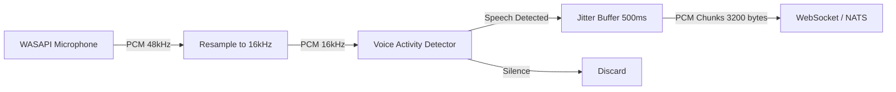

# SimConnect Client Specification

## Overview

The SimConnect Client is a C# .NET 8 application that runs on the same machine as Microsoft Flight Simulator (MSFS). It provides the bridge between the simulator and the AI-ATC backend services.

## Architecture

```mermaid
graph TD
  MSFS[MSFS SimConnect API] -->|SimConnect Protocol| SC[SimConnect Connector]
  SC -->|C# Events| TP[Telemetry Publisher]
  SC -->|Raw Audio| AL[Audio Loopback]
  TP -->|WebSocket JSON| AE[ATC Engine]
  AL -->|PCM Stream| NATUS[NATS / WebSocket]
  NATUS -->|TTS Audio| AL
  AL -->|WASAPI Playback| MSFS
  
  subgraph Audio
    MIC[Microphone Capture]
    SPK[Speaker Playback]
  end
  
  MIC -->|WASAPI| AL
  SPK <--|WASAPI| AL
```

## SimConnect Connector

### Connection Lifecycle

1. **Start**: Launch SimConnect client (auto-start via MSFS startup gauge or manual launch)
2. **Connect**: `SimConnect.Connect("OpenATC", IntPtr.Zero, 0, ...)`
3. **Subscribe**: Request SimObject data on `SIMCONNECT_PERIOD_SIM_FRAME` (~10 Hz)
4. **Loop**: Process `Recv` events on dedicated STA thread
5. **Disconnect**: `SimConnect.Disconnect()` on app exit

### Data Requests

```csharp
// Define data structure
[StructLayout(LayoutKind.Sequential, Pack = 1)]
public struct SimConnectData
{
    // Position
    public double Latitude;
    public double Longitude;
    public double Altitude;
    public double Pitch;
    public double Bank;
    public double Heading;
    
    // Speed
    public double AirspeedIndicated;
    public double AirspeedTrue;
    public double GroundSpeed;
    public double VerticalSpeed;
    
    // Status
    public uint OnGround;
    public uint GearHandle;
    public uint FlapsHandle;
    public uint EngineRunning;
    public uint TransponderCode;
    public uint TransponderMode;
}

// Register data definition
simConnect.AddToDataDefinition(
    DEFINITION_MAIN,
    "STRUCTURED DATA",  // custom client area
    SIMCONNECT_DATATYPE.STRING64,  // serialized as JSON
    0,
    SimConnect.SIMCONNECT_UNUSED_DIMENSION
);

// Request at sim frame rate
simConnect.RequestDataOnSimObject(
    REQUEST_MAIN,
    DEFINITION_MAIN,
    SIMCONNECT_OBJECT_ID_USER,
    SIMCONNECT_PERIOD.SIM_FRAME,
    SIMCONNECT_DATA_REQUEST_FLAG.DEFAULT,
    0, 0, 0
);
```

**Alternative approach**: Request individual properties for finer control:

```csharp
simConnect.AddToDataDefinition(
    DEFINITION_POSITION,
    "PLANE LATITUDE", "degrees",
    SIMCONNECT_DATATYPE.FLOAT64, ...
);
```

## Telemetry Publisher

- Reads `SimConnectData` from connector
- Marshals to JSON using `System.Text.Json` (source generators)
- Publishes to configured endpoint: WebSocket (`ws://atc-engine:8200/api/v1/ws`) or NATS subject `telemetry.raw.{callsign}`
- Emits frames at 10 Hz (configurable: 5–25 Hz)
- Implements backpressure: drops oldest frame if publish channel full
- Reconnects with exponential backoff (100ms base, 30s max, jitter 20%)

```csharp
public class TelemetryPublisher : BackgroundService
{
    private readonly ClientWebSocket _ws;
    private readonly Channel<TelemetryFrame> _frameChannel;
    
    protected override async Task ExecuteAsync(CancellationToken ct)
    {
        while (!ct.IsCancellationRequested)
        {
            await foreach (var frame in _frameChannel.Reader.ReadAllAsync(ct))
            {
                var json = JsonSerializer.Serialize(frame, TelemetryContext.Default.TelemetryFrame);
                await _ws.SendAsync(json, WebSocketMessageType.Text, true, ct);
            }
        }
    }
}
```

## Audio Loopback Architecture

### Capture (Pilot Mic → Backend)



- **Capture API**: WASAPI loopback via NAudio or CSCore
- **Sample Rate**: 48 kHz from mic, resampled to 16 kHz for STT
- **Chunk Size**: 100ms = 1600 samples @ 16kHz = 3200 bytes (16-bit PCM)
- **VAD**: Silero VAD (onnx) or energy-based threshold (-30dB)
- **PTT Detection**: Optional PTT keybind detection via SimConnect events; auto-VAD as fallback
- **Streaming**: Audio sent via WebSocket binary frames or NATS JetStream `audio.pilot.{callsign}`

### Playback (Backend TTS → MSFS)


- **Playback API**: WASAPI event-driven via NAudio
- **Sample Rate**: 22.05 kHz from TTS, resampled to 48 kHz for output
- **Buffer**: 150ms jitter buffer (3 frames of 50ms each)
- **Radio Effect**: Bandpass 300Hz–3.4kHz, slight compression (ratio 2:1), -3dB gain
- **Chatter Spacing**: Minimum 500ms gap between transmissions (prevent overlap)

### Audio Packet Wire Format (NATS)

See `protocol.md` for the 12-byte binary header format:

```
Offset  Size  Field
0       4     Magic: 0x41544301
4       2     Sample rate (e.g., 22050)
6       1     Bits per sample (16)
7       1     Channels (1)
8       4     Payload length (big-endian)
12      N     Raw PCM 16-bit signed LE
```

## Configuration

```json
{
  "atc_engine": {
    "ws_url": "ws://localhost:8200/api/v1/ws",
    "token": "${ATC_API_TOKEN}",
    "reconnect_base_ms": 100,
    "reconnect_max_ms": 30000
  },
  "nats": {
    "url": "nats://localhost:4222",
    "telemetry_subject": "telemetry.raw",
    "audio_subject": "audio"
  },
  "telemetry": {
    "rate_hz": 10,
    "max_queue": 5
  },
  "audio": {
    "capture_device": "{WASAPI_DEVICE_ID}",
    "playback_device": "{WASAPI_DEVICE_ID}",
    "vad_threshold_db": -30,
    "sample_rate_stt_hz": 16000,
    "sample_rate_tts_hz": 22050,
    "jitter_buffer_ms": 150
  },
  "simconnect": {
    "application_name": "OpenATC",
    "auto_connect": true
  }
}
```

## Dependencies

| Package | Version | Purpose |
|---------|---------|---------|
| `Microsoft.FlightSimulator.SimConnect` | SDK | SimConnect protocol |
| `NAudio` | 2.2+ | WASAPI audio capture/playback |
| `System.Text.Json` | built-in | JSON serialization |
| `Microsoft.Extensions.Hosting` | 8.0 | Background service lifecycle |
| `Microsoft.Extensions.Configuration.Json` | 8.0 | JSON config |
| `NATS.Client` | 1.1+ | NATS messaging (optional) |
| `Serilog` | 3.0+ | Structured logging |

## Build & Run

```bash
# Build
cd simconnect-client/src
dotnet restore
dotnet build -c Release

# Run (standalone)
dotnet run -c Release -- --config appsettings.json

# Run as MSFS startup gauge
# Copy output to MSFS Community folder
```

## SimConnect Event Handling

```csharp
// Key events to handle
simConnect.OnRecvOpen += (_, _) => { /* connected */ };
simConnect.OnRecvQuit += (_, _) => { /* MSFS closing */ };
simConnect.OnRecvException += (_, args) => { /* error handling */ };
simConnect.OnRecvSimobjectData += (_, args) => {
    var data = (SimConnectData)args.dwData[0];
    // Marshal and publish
};
```

## Retry & Resilience

| Scenario | Behavior |
|----------|----------|
| MSFS not running | Poll SimConnect.Connect() every 5s |
| WebSocket disconnect | Exponential backoff, max 30s |
| Audio device lost | Re-initialize WASAPI, log warning |
| NATS unavailable | Fall back to direct WebSocket |
| Backpressure | Drop oldest telemetry frame |
