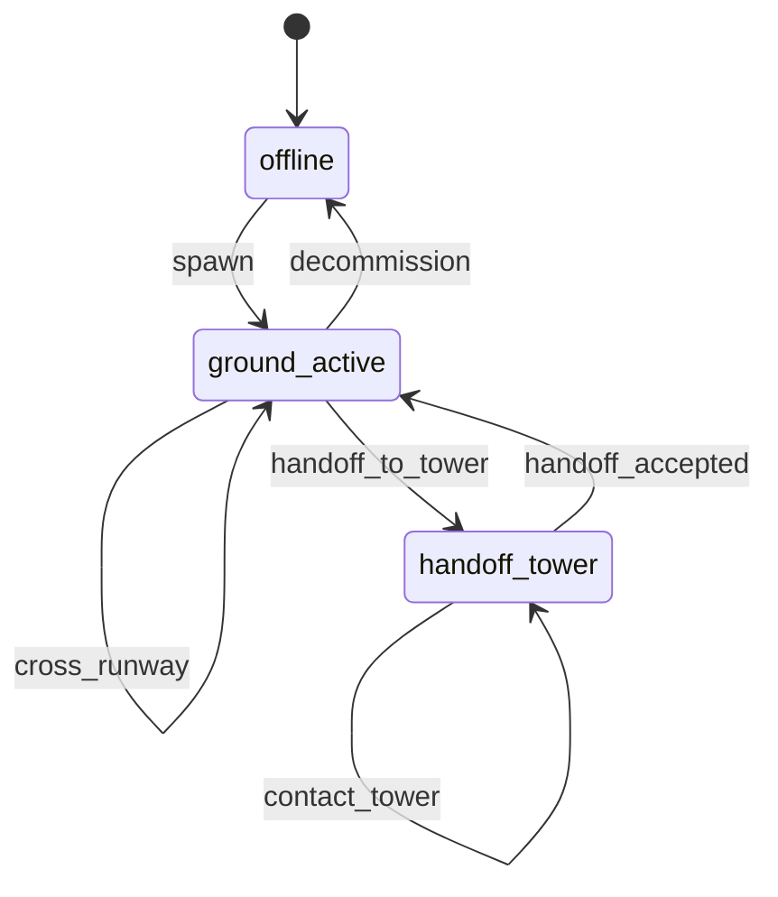
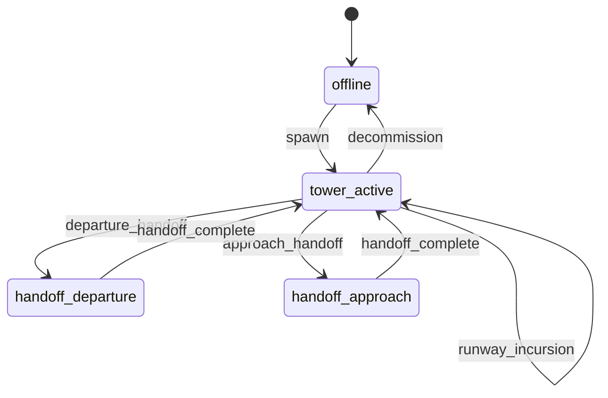
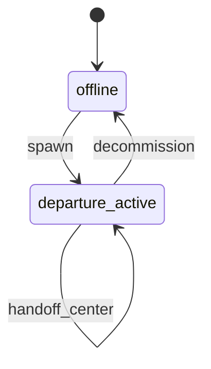
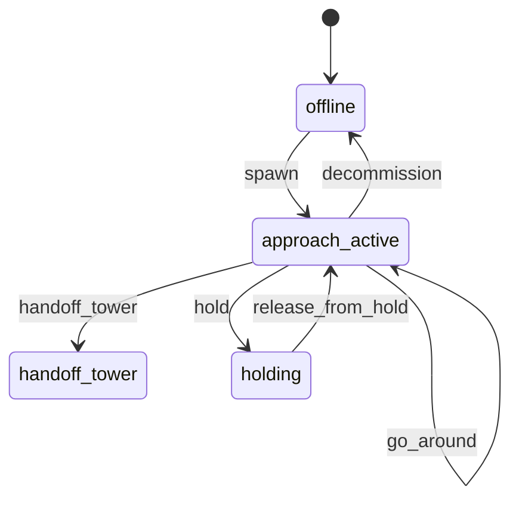
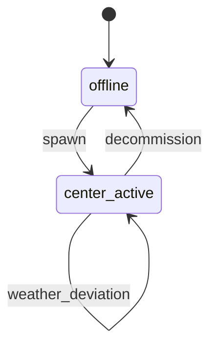
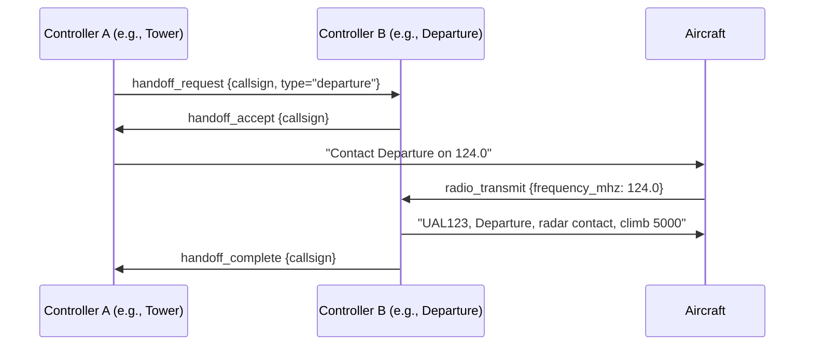

# ATC Controller State Machines

## Overview

Each controller type implements a hierarchical state machine. Transitions are triggered by:
- **Telemetry events** (aircraft enters a sector, crosses a boundary)
- **Pilot radio calls** (request pushback, request taxi, report inbound)
- **Temporal events** (timeout waiting for response)
- **LLM-generated intents** (validated against current state)

All state machines are deterministic, pure Python with no LLM dependency for safety-critical transitions.

## Ground Controller



### States

| State | Description |
|-------|-------------|
| `offline` | Controller not active |
| `ground_active` | Normal ground control operations |
| `handoff_tower` | Aircraft being transferred to tower |

### Transitions

| Current State | Event | Next State | Guard |
|---------------|-------|------------|-------|
| `offline` | `spawn` | `ground_active` | Airport exists in DB |
| `ground_active` | `pushback_request` | `ground_active` | Aircraft at gate, no conflicts |
| `ground_active` | `pushback_approved` | `ground_active` | Pushback direction clear |
| `ground_active` | `taxi_request` | `ground_active` | Taxi route available |
| `ground_active` | `taxi_approved` | `ground_active` | Runway not blocked |
| `ground_active` | `hold_short` | `ground_active` | Runway crossing active |
| `ground_active` | `cross_runway` | `ground_active` | Crossing clearance granted |
| `ground_active` | `handoff_to_tower` | `handoff_tower` | Aircraft at hold-short |
| `handoff_tower` | `handoff_accepted` | `ground_active` | Tower confirms |
| `any` | `decommission` | `offline` | All traffic reassigned |

### Data Model

```python
class GroundController:
    state: GroundState
    airport: Airport
    active_aircraft: list[AircraftGroundState]
    runway_crossing_queue: list[str]  # callsigns
    pushback_directions: dict[str, str]  # callsign -> direction
```

## Tower Controller



### States

| State | Description |
|-------|-------------|
| `offline` | Controller not active |
| `tower_active` | Normal local control operations |
| `handoff_departure` | Departure being transferred to departure controller |
| `handoff_approach` | Arrival transferred from approach controller |

### Key Transitions

| Current State | Event | Next State | Guard |
|---------------|-------|------------|-------|
| `tower_active` | `departure_request` | `tower_active` | Runway assigned, no conflicts |
| `tower_active` | `line_up` | `tower_active` | Runway clear, departure interval met |
| `tower_active` | `takeoff_clearance` | `tower_active` | Line-up complete, separation OK |
| `tower_active` | `inbound_report` | `tower_active` | Approach controller coordinate |
| `tower_active` | `landing_clearance` | `tower_active` | Runway clear, separation OK |
| `tower_active` | `go_around` | `tower_active` | Runway occupied or unstable approach |
| `tower_active` | `runway_incursion` | `tower_active` | Alert state — deny all takeoff/landing |

### Separation Rules (Tower)

- **Departure separation**: 2 minutes (same runway), 1 minute (parallel runways > 2500ft apart)
- **Arrival separation**: 3 NM radar separation or 2 minutes time-based
- **Wake turbulence**: Heavy preceding Heavy: 4 NM; Heavy preceding Medium: 5 NM; Heavy preceding Light: 6 NM
- **Runway occupancy**: No takeoff clearance if preceding arrival has not exited runway

## Departure Controller



### Separation Rules (Departure)

- **Diverging headings**: Minimum 45-degree divergence within 5 NM
- **Altitude assignment**: IFR departures get initial altitude based on SID
- **Turn-on**: No turns below 400ft AGL unless published on SID
- **Speed restriction**: 250 KIAS below 10,000ft MSL (unless otherwise assigned)

## Approach Controller



### Separation Rules (Approach)

- **Arrival stream merge**: 3 NM separation at merge point
- **Final approach separation**: 4 NM for jets, 3 NM for props (same runway); 2 NM for parallel runways
- **ILS critical area**: No aircraft within 2 NM of ILS critical area during low visibility
- **Holding**: Max 10 minutes at EFC time; 1-minute inbound/outbound legs

## Center Controller (Enroute)



### Separation Rules (Center)

- **Enroute separation**: 5 NM lateral or 1000ft vertical (FL290 and below); 2000ft vertical above FL290 (RVSM airspace excepted)
- **Reduced separation**: 5 NM with radar; 3 NM with approved automation
- **Crossing traffic**: 5 NM or 1000ft when flight paths cross
- **Oceanic**: 10 NM lateral or 30 minutes Mach-based longitudinal

## Controller Handoff Protocol



## State Machine Implementation Pattern

```python
from enum import Enum
from dataclasses import dataclass, field

class GroundState(str, Enum):
    OFFLINE = "offline"
    ACTIVE = "ground_active"
    HANDOFF_TOWER = "handoff_tower"

@dataclass
class GroundControllerSM:
    state: GroundState = GroundState.OFFLINE
    airport_icao: str = ""
    frequency_mhz: float = 121.7

    def transition(self, event: str, **kwargs) -> str | None:
        handler = getattr(self, f"on_{event}", None)
        if handler is None:
            raise ValueError(f"Unknown event: {event}")
        return handler(**kwargs)

    def on_pushback_request(self, callsign: str) -> str | None:
        # Validate, compute direction, respond
        return "pushback_approved"

    def on_taxi_request(self, callsign: str, destination: str) -> str | None:
        # Compute taxi route, check conflicts
        return "taxi_approved"
```

This pattern is replicated for each controller type. State machine logic lives in `atc-engine/src/controllers/`.
