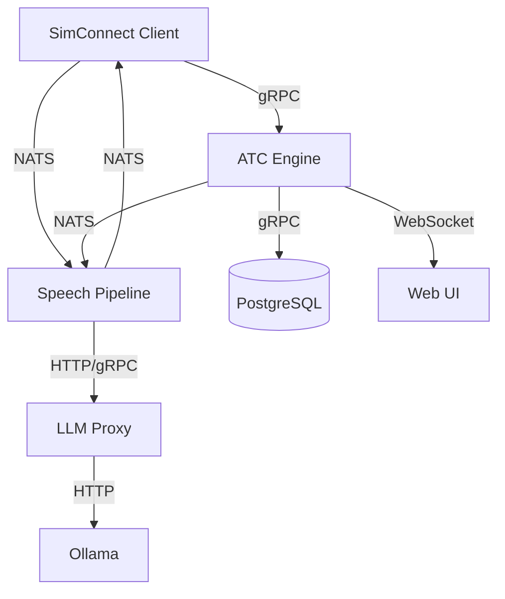

# Internal Microservice RPC Protocol

## Transport Layer

All internal service-to-service communication uses **gRPC** over HTTP/2 with Protocol Buffers (proto3) for payload serialization.

For streaming audio / telemetry where gRPC is impractical, **NATS JetStream** is used as a message bus (pub/sub with exactly-once semantics).

## Service Mesh



## Protobuf Definitions

### `telemetry.proto`

```protobuf
syntax = "proto3";
package openatc.telemetry.v1;

import "google/protobuf/timestamp.proto";
import "google/protobuf/wrappers.proto";

message TelemetryFrame {
  string callsign = 1;
  double latitude = 2;
  double longitude = 3;
  double altitude_msl_ft = 4;
  double altitude_agl_ft = 5;
  double heading_true = 6;
  double heading_mag = 7;
  double speed_ias_kn = 8;
  double speed_gs_kn = 9;
  double speed_vs_fpm = 10;
  double pitch_deg = 11;
  double bank_deg = 12;
  bool on_ground = 13;
  bool gear_down = 14;
  float flaps_pct = 15;
  bool engine_running = 16;
  string transponder_code = 17;
  string transponder_mode = 18;
  google.protobuf.Timestamp sim_time = 19;
  google.protobuf.Timestamp recorded_at = 20;
}

message TelemetryBatch {
  repeated TelemetryFrame frames = 1;
  string source_id = 2;
}

service TelemetryService {
  rpc StreamTelemetry(stream TelemetryFrame) returns (TelemetryAck);
  rpc BatchTelemetry(TelemetryBatch) returns (TelemetryAck);
  rpc GetLatestPosition(GetLatestPositionRequest) returns (TelemetryFrame);
}

message TelemetryAck {
  bool accepted = 1;
  int32 frames_received = 2;
}

message GetLatestPositionRequest {
  string callsign = 1;
}
```

### `controller.proto`

```protobuf
syntax = "proto3";
package openatc.controller.v1;

import "google/protobuf/timestamp.proto";

enum ControllerType {
  CONTROLLER_TYPE_UNSPECIFIED = 0;
  CONTROLLER_TYPE_GROUND = 1;
  CONTROLLER_TYPE_TOWER = 2;
  CONTROLLER_TYPE_DEPARTURE = 3;
  CONTROLLER_TYPE_APPROACH = 4;
  CONTROLLER_TYPE_CENTER = 5;
}

enum ControllerState {
  CONTROLLER_STATE_UNSPECIFIED = 0;
  CONTROLLER_STATE_OFFLINE = 1;
  CONTROLLER_STATE_SPAWNING = 2;
  CONTROLLER_STATE_ACTIVE = 3;
  CONTROLLER_STATE_HANDOFF = 4;
  CONTROLLER_STATE_ERROR = 5;
}

message ControllerPosition {
  string id = 1;
  string callsign = 2;
  ControllerType type = 3;
  double frequency_mhz = 4;
  ControllerState state = 5;
  string airport_icao = 6;
  repeated string sectors = 7;
  int32 active_traffic_count = 8;
  string current_state_machine = 9;
  int32 state_machine_version = 10;
  bool llm_enabled = 11;
}

message GetControllersRequest {}
message GetControllersResponse {
  repeated ControllerPosition controllers = 1;
}

message SpawnControllerRequest {
  ControllerType type = 1;
  string airport_icao = 2;
  double frequency_mhz = 3;
  string callsign = 4;
  bool llm_enabled = 5;
}

message SpawnControllerResponse {
  ControllerPosition controller = 1;
}

message DecommissionControllerRequest {
  string controller_id = 1;
}
message DecommissionControllerResponse {}

message GetControllerStateRequest {
  string controller_id = 1;
}

message AircraftState {
  string callsign = 1;
  string state = 2;
  string parking_spot = 3;
  repeated string assigned_route = 4;
  google.protobuf.Timestamp last_contact = 5;
}

message ControllerDetail {
  ControllerPosition position = 1;
  repeated AircraftState active_aircraft = 2;
  repeated Clearance pending_clearances = 3;
}

message Clearance {
  string aircraft_id = 1;
  string clearance_type = 2;
  map<string, string> parameters = 3;
}

service ControllerService {
  rpc GetControllers(GetControllersRequest) returns (GetControllersResponse);
  rpc SpawnController(SpawnControllerRequest) returns (SpawnControllerResponse);
  rpc DecommissionController(DecommissionControllerRequest) returns (DecommissionControllerResponse);
  rpc GetControllerState(GetControllerStateRequest) returns (ControllerDetail);
  rpc SubmitClearance(SubmitClearanceRequest) returns (SubmitClearanceResponse);
}

message SubmitClearanceRequest {
  string controller_id = 1;
  string target_callsign = 2;
  string clearance_type = 3;
  map<string, string> parameters = 4;
}

message SubmitClearanceResponse {
  bool accepted = 1;
  string clearance_id = 2;
  string state_machine_transition = 3;
  string generated_transmission = 4;
}
```

### `speech.proto`

```protobuf
syntax = "proto3";
package openatc.speech.v1;

message AudioChunk {
  bytes pcm_data = 1;
  int32 sample_rate_hz = 2;
  int32 sequence = 3;
  bool final = 4;
  string session_id = 5;
}

message TranscribedText {
  string text = 1;
  string callsign = 2;
  float confidence = 3;
  bool partial = 4;
  string session_id = 5;
}

message SynthesizeRequest {
  string text = 1;
  string voice_profile = 2;  // e.g., "female_en_us", "male_en_uk"
  string controller_id = 3;
}

message SynthesizeResponse {
  bytes pcm_data = 1;
  int32 sample_rate_hz = 2;
  int32 duration_ms = 3;
}

service SpeechService {
  rpc TranscribeStream(stream AudioChunk) returns (stream TranscribedText);
  rpc Synthesize(SynthesizeRequest) returns (SynthesizeResponse);
}
```

### `clearance.proto`

```protobuf
syntax = "proto3";
package openatc.clearance.v1;

message ValidateClearanceRequest {
  string clearance_text = 1;
  string controller_type = 2;
  string airport_icao = 3;
  string active_runway = 4;
}

message ValidateClearanceResponse {
  bool valid = 1;
  repeated string warnings = 2;
  string normalized = 3;
}

service ClearanceValidationService {
  rpc Validate(ValidateClearanceRequest) returns (ValidateClearanceResponse);
}
```

## NATS JetStream Subjects

| Subject | Payload Type | Producer | Consumer(s) |
|---------|-------------|----------|-------------|
| `telemetry.raw.{callsign}` | `TelemetryFrame` (JSON) | SimConnect Client | ATC Engine |
| `audio.pilot.{callsign}` | `AudioChunk` (protobuf) | SimConnect Client | Speech Pipeline |
| `audio.atc.{controller_id}` | `AudioChunk` (protobuf) | Speech Pipeline | SimConnect Client |
| `clearance.{controller_id}` | `SubmitClearanceRequest` (JSON) | ATC Engine | All |
| `state.controller.{controller_id}` | `ControllerPosition` (JSON) | ATC Engine | Web UI |

## Binary Payload — Audio Wire Format

For internal audio transport (NATS or gRPC streams), audio uses:

| Offset | Size | Field |
|--------|------|-------|
| 0 | 4 | Magic: `0x41544301` (big-endian) |
| 4 | 2 | Sample rate (e.g., `16000` or `22050`) |
| 6 | 1 | Bits per sample (always `16`) |
| 7 | 1 | Channels (always `1`) |
| 8 | 4 | Payload length N (big-endian, bytes) |
| 12 | N | Raw PCM 16-bit signed little-endian samples |

Total header: 12 bytes. This format is used when sending audio between the SimConnect client and speech pipeline over NATS.
