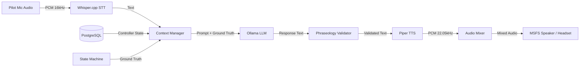

# Speech Pipeline

## Pipeline Architecture



## Component Details

### 1. STT — Whisper.cpp

- **Model**: `ggml-large-v3-q5_0.bin` (or `ggml-base.en.bin` for lower resource)
- **Sample Rate**: 16 kHz mono PCM
- **Inference**: Local via whisper.cpp Python bindings (`whisper-cpp-python`)
- **Mode**: Streaming with voice activity detection (VAD)
- **Latency Target**: < 500ms for utterance completion

```python
# Pseudocode interface
class STTPipeline:
    async def transcribe_stream(
        self,
        audio_stream: AsyncIterator[NDArray[np.float32]],
    ) -> AsyncIterator[TranscriptionChunk]:
        """Yields partial/final transcriptions."""
        ...
```

**Configuration:**

```yaml
stt:
  model: "ggml-large-v3-q5_0.bin"
  model_path: "/models/whisper"
  language: "en"
  beam_size: 5
  vad_threshold: 0.5
  min_utterance_ms: 300
  max_utterance_ms: 15000
```

### 2. Context Manager

Assembles the LLM prompt from:
1. **System prompt** — Fixed instruction defining the AI's role as an ATC controller
2. **Controller state** — Current state machine state, active runways, traffic count
3. **Active aircraft context** — List of aircraft under control with their states
4. **Radio history** — Sliding window of recent radio calls (last 10 exchanges)
5. **Pilot intent** — Transcribed text from STT

```python
@dataclass
class LLMContext:
    system_prompt: str
    controller_state: ControllerDetail
    active_aircraft: list[AircraftState]
    radio_history: list[RadioCall]
    pilot_transcript: str
    ground_truth: GroundTruthInjector
```

**Prompt Template:**

```
You are {controller_callsign} at {airport_icao}.
Current time: {sim_time}
Frequency: {frequency_mhz} MHz
State: {state_machine}

Active traffic:
{active_aircraft_table}

Recent calls:
{radio_history}

The pilot ({callsign}) says: "{pilot_transcript}"

Respond with a concise ATC radio call using standard phraseology.
If the request cannot be fulfilled, state the reason.
Respond ONLY with the radio call text, no explanations.
```

### 3. LLM — Ollama

- **Model**: `llama3.1:8b` (minimum), `qwen2.5:14b` or `mixtral:8x7b` (recommended)
- **Endpoint**: `http://ollama:11434/api/generate`
- **Context Window**: 8192 tokens (sliding window of last 4096)
- **Generation Parameters**:
  - `temperature`: 0.3 (low for deterministic ATC responses)
  - `top_p`: 0.9
  - `max_tokens`: 256
  - `stop`: ["\n\n", "Pilot:", "("]
- **Timeout**: 30s per generation
- **Retry**: 1 retry on failure, then fallback to phraseology template

```python
class LLMProxy:
    async def generate(
        self,
        context: LLMContext,
        timeout: float = 30.0,
    ) -> str:
        prompt = self._build_prompt(context)
        response = await self._ollama_generate(prompt, timeout=timeout)
        validated = self._validate_phraseology(response)
        return validated or self._fallback_template(context)
```

### 4. Phraseology Validator

Lightweight rule engine that checks LLM output against expected patterns before transmission.

**Validation rules:**
- Must include target callsign
- Must not contain markdown, JSON, or explanatory text
- Must match expected pattern for current controller state
- Must not contradict active clearances (e.g., assign same runway to two aircraft)

```python
class PhraseologyValidator:
    def validate(self, text: str, context: ControllerDetail) -> ValidationResult:
        checks = [
            self._check_callsign_present(text, context),
            self._check_no_markdown(text),
            self._check_state_appropriate(text, context),
            self._check_no_conflicts(text, context),
        ]
        failures = [c for c in checks if not c.passed]
        return ValidationResult(valid=len(failures) == 0, failures=failures)
```

### 5. TTS — Piper

- **Model**: `en_US-lessac-medium.onnx` (or `en_US-amy-low.onnx` for speed)
- **Sample Rate**: 22.05 kHz mono PCM (upsampled from 16kHz if needed)
- **Inference**: Local via piper-tts Python bindings
- **Latency Target**: < 200ms (first audio) for streaming synthesis

```python
class TTSPipeline:
    async def synthesize(
        self,
        text: str,
        voice: str = "en_US-lessac-medium",
    ) -> AsyncIterator[NDArray[np.float32]]:
        """Yields PCM chunks as they are generated (streaming)."""
        ...
```

**Configuration:**

```yaml
tts:
  model: "en_US-lessac-medium.onnx"
  model_path: "/models/piper"
  voice: "en_US-lessac-medium"
  length_scale: 1.0  # >1 = slower, <1 = faster
  noise_scale: 0.667
  noise_w: 0.8
  sentence_silence_ms: 200
```

### 6. Audio Mixer

- **Inputs**: TTS output (ATC audio), optional ambient effects
- **Processing**: Gain normalization, optional reverb for radio effect (bandpass filter 300Hz–3.4kHz)
- **Output**: PCM 16-bit 22.05kHz mono sent to SimConnect audio loopback

## Latency Budget

```mermaid
gantt
    title Audio Pipeline Latency Budget
    dateFormat X
    axisFormat %s
    section STT
    VAD + Inference      : 0, 800
    section LLM
    Context + Generate   : 800, 4800
    section TTS
    Streaming Synthesis  : 4800, 5400
    section Total
    End-to-End           : 0, 5400
```



| Stage | Target (ms) | Budget (ms) |
|-------|-------------|-------------|
| VAD + Audio Buffering | 200 | 300 |
| Whisper STT Inference | 300 | 500 |
| Context Assembly | 10 | 20 |
| LLM Generation | 2000 | 4000 |
| Phraseology Validation | 5 | 10 |
| Piper TTS (first chunk) | 150 | 200 |
| Total | ~2665 | ~5030 |

## Fallback Strategy

```mermaid
flowchart TD
  STT[STT succeeds?] -->|Yes| LLM[Run LLM]
  STT -->|No, low confidence| RETRY[Re-request with "Say again?"]
  LLM -->|Response valid| TTS[Synthesize & transmit]
  LLM -->|Timeout| FALLBACK[Use template-based response]
  LLM -->|Invalid phraseology| FALLBACK
  FALLBACK --> TTS
  RETRY --> STT
```

**Fallback template examples** (no LLM required):

| Pilot Call | Fallback Response |
|------------|-------------------|
| "Request pushback" | "{callsign}, pushback approved, tail {direction}." |
| "Ready for taxi" | "{callsign}, taxi to runway {runway} via {route}." |
| "Ready for departure" | "{callsign}, runway {runway}, line up and wait." |
| (Unintelligible) | "{callsign}, say again?" |
| (No response) | "{callsign}, {controller} radio, check." |

## Model Storage

All models are stored outside the container at a configurable host path and mounted read-only:

```
/path/to/models/
├── whisper/
│   └── ggml-large-v3-q5_0.bin
├── piper/
│   ├── en_US-lessac-medium.onnx
│   └── en_US-lessac-medium.onnx.json
└── ollama/
    └── (managed by Ollama itself)
```
