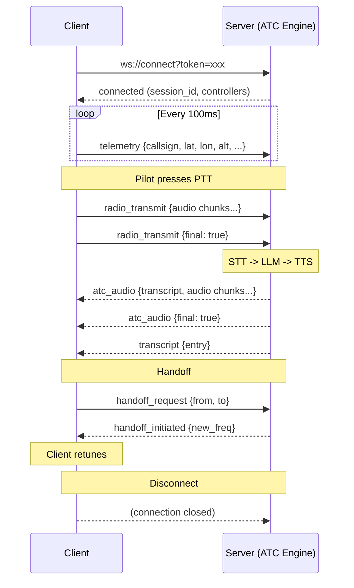

# WebSocket Specification

## Connection

**Endpoint**: `ws://localhost:8200/api/v1/ws`

Authentication via query parameter: `?token=<bearer_token>`

All messages are JSON-encoded frames with the following envelope:

```json
{
  "event": "event_type",
  "ts": 1722249600000,
  "source": "simconnect-client | atc-engine | speech-pipeline | web-ui",
  "data": { }
}
```

---

## Events — Client → Server

### `connect`

Pilot or client connecting to the ATC system. Establishes identity and requests service.

```json
{
  "event": "connect",
  "ts": 1722249600000,
  "source": "simconnect-client",
  "data": {
    "client_type": "simconnect",
    "version": "0.1.0",
    "callsign": null,
    "session_id": "sess_abc123"
  }
}
```

| Field | Type | Description |
|-------|------|-------------|
| `client_type` | string | `simconnect`, `web-ui`, `admin` |
| `version` | string | Semver of the client |
| `callsign` | string\|null | Aircraft callsign (null for simconnect client) |
| `session_id` | string | Client-generated session UUID |

---

### `telemetry`

Aircraft state frame, emitted at ~10 Hz from SimConnect client.

```json
{
  "event": "telemetry",
  "ts": 1722249600100,
  "source": "simconnect-client",
  "data": {
    "callsign": "UAL123",
    "lat": 33.9425,
    "lon": -118.4081,
    "alt_msl_ft": 35000,
    "alt_agl_ft": 35000,
    "heading_true": 242.1,
    "heading_mag": 240.5,
    "speed_ias_kn": 280,
    "speed_gs_kn": 295,
    "speed_vs_fpm": 0,
    "pitch_deg": 2.1,
    "bank_deg": 0.5,
    "on_ground": false,
    "gear_down": false,
    "flaps_pct": 0,
    "engine_running": true,
    "transponder_code": "1200",
    "transponder_mode": "alt",
    "sim_time": 50400
  }
}
```

| Field | Type | Description |
|-------|------|-------------|
| `callsign` | string | Assigned aircraft callsign |
| `lat` | float64 | WGS84 latitude |
| `lon` | float64 | WGS84 longitude |
| `alt_msl_ft` | float64 | Altitude above mean sea level (feet) |
| `alt_agl_ft` | float64 | Altitude above ground level (feet) |
| `heading_true` | float64 | True heading (degrees) |
| `heading_mag` | float64 | Magnetic heading (degrees) |
| `speed_ias_kn` | float64 | Indicated airspeed (knots) |
| `speed_gs_kn` | float64 | Ground speed (knots) |
| `speed_vs_fpm` | float64 | Vertical speed (feet per minute) |
| `pitch_deg` | float64 | Pitch angle |
| `bank_deg` | float64 | Bank angle |
| `on_ground` | bool | Weight-on-wheels flag |
| `gear_down` | bool | Landing gear state |
| `flaps_pct` | float64 | Flaps deployment percentage |
| `engine_running` | bool | Engine(s) running |
| `transponder_code` | string | Squawk code (4 octal digits) |
| `transponder_mode` | string | `off`, `stby`, `on`, `alt` |
| `sim_time` | float64 | Simulator elapsed time (seconds) |

---

### `radio_transmit`

Pilot push-to-talk audio captured via SimConnect audio loopback. Binary audio (PCM) is sent as a base64-encoded field, or streamed in chunks.

```json
{
  "event": "radio_transmit",
  "ts": 1722249600500,
  "source": "simconnect-client",
  "data": {
    "callsign": "UAL123",
    "frequency_mhz": 118.3,
    "audio_format": {
      "codec": "PCM_16LE",
      "sample_rate_hz": 16000,
      "channels": 1
    },
    "audio_base64": "//uQxAAAAAANIAAAAAE...",
    "sequence": 1,
    "final": false
  }
}
```

| Field | Type | Description |
|-------|------|-------------|
| `callsign` | string | Transmitting aircraft |
| `frequency_mhz` | float64 | Target radio frequency |
| `audio_format` | object | Codec metadata |
| `audio_base64` | string | Raw PCM chunk (base64) |
| `sequence` | int32 | Chunk sequence number (0-based) |
| `final` | bool | True if this is the last chunk |
| `duration_ms` | int32 | Total audio duration once final is received |

Telemetry frames are sent at 10 Hz (every 100ms). The `ts` field corresponds to the simulator time at which the data was sampled.

---

### `handoff_request`

Aircraft-initiated frequency change request (e.g., when switching to next controller).

```json
{
  "event": "handoff_request",
  "ts": 1722249600000,
  "source": "atc-engine",
  "data": {
    "callsign": "UAL123",
    "from_controller": "KLAX_TWR",
    "to_controller": "KLAX_APP",
    "frequency_mhz": 124.0,
    "reason": "departure"
  }
}
```

---

## Events — Server → Client

### `connected`

Acknowledges the client connection with assigned session.

```json
{
  "event": "connected",
  "ts": 1722249600001,
  "source": "atc-engine",
  "data": {
    "session_id": "sess_abc123",
    "server_version": "0.1.0",
    "controllers": ["KLAX_GND", "KLAX_TWR"]
  }
}
```

---

### `controller_state`

State machine update for a specific controller.

```json
{
  "event": "controller_state",
  "ts": 1722249600000,
  "source": "atc-engine",
  "data": {
    "controller_id": "KLAX_TWR",
    "state_machine": "tower_active",
    "version": 42,
    "active_traffic_count": 5
  }
}
```

---

### `atc_audio`

Outbound ATC radio transmission (TTS audio). Sent from speech pipeline after LLM generates response, streamed in chunks.

```json
{
  "event": "atc_audio",
  "ts": 1722249601000,
  "source": "speech-pipeline",
  "data": {
    "controller_id": "KLAX_TWR",
    "target_callsign": "UAL123",
    "frequency_mhz": 118.3,
    "transcript": "UAL123, runway 24L, cleared for takeoff, wind 240 at 8.",
    "audio_format": {
      "codec": "PCM_16LE",
      "sample_rate_hz": 22050,
      "channels": 1
    },
    "audio_base64": "//uQxAAAAAANIAAAAAE...",
    "sequence": 0,
    "final": false,
    "duration_ms": 3200
  }
}
```

When the full transmission is complete, a final frame with `final: true` is sent and no further sequence frames will arrive.

---

### `handoff_initiated`

Server acknowledges handoff and provides new contact frequency.

```json
{
  "event": "handoff_initiated",
  "ts": 1722249600000,
  "source": "atc-engine",
  "data": {
    "callsign": "UAL123",
    "from_controller": "KLAX_TWR",
    "to_controller": "KLAX_APP",
    "new_frequency_mhz": 124.0,
    "contact_instruction": "Contact Approach on 124.0",
    "expires_at": 1722249700000
  }
}
```

---

### `transcript`

Human-readable radio transcript entry for the Web UI strip board.

```json
{
  "event": "transcript",
  "ts": 1722249601000,
  "source": "atc-engine",
  "data": {
    "id": "tr_001",
    "controller_id": "KLAX_TWR",
    "callsign": "UAL123",
    "direction": "inbound | outbound",
    "text": "UAL123, runway 24L, cleared for takeoff, wind 240 at 8.",
    "audio_available": true
  }
}
```

---

### `error`

Error notification (e.g., validation failure, LLM timeout).

```json
{
  "event": "error",
  "ts": 1722249600000,
  "source": "atc-engine",
  "data": {
    "code": "LLM_TIMEOUT",
    "message": "LLM inference exceeded 30s timeout",
    "details": {}
  }
}
```

---

## Connection Lifecycle



All JSON payloads use `snake_case` field names. Timestamps are Unix milliseconds (int64). Audio is always PCM 16-bit little-endian, base64-encoded for WebSocket transport.
